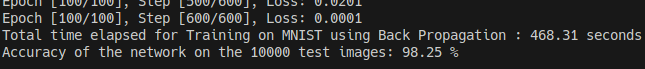
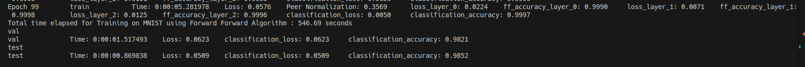

# FML Project 2024

We have tried to reimplementing the **Forward Forward Algorithm** of Geoffrey Hinton's paper which was released in 2022

The link to the official paper is : [paper link](https://arxiv.org/pdf/2212.13345)

Link to the presentation : [Google Slides](https://docs.google.com/presentation/d/11HqIvHWVlyYj0uz_VWsOP_4j8OGDM5nU7cDvPpuhBX4/edit?usp=sharing)


## How to run this repo

Clone this repo

```bash
git clone https://github.com/AvAkanksh/FML_FF_Project.git
```

Go into the directory FML_FF_Project
```bash
cd FML_FF_Project
```

Now **create a virtual environment** with your desired environment name
```bash
python -m venv <virtual-environment-name>
```

**Activate** the environment
```bash
source <virtual-environment-name>/bin/activate
```

Firstly install the libraries which are need to run this module which are present in requirement.txt

```bash
pip install -r requirements.txt
```

To **train** the MNIST DATASET using Forward Forward Algorithm

```bash
python main.py
```

To **change the hyperparameters** in the model you can directly edit the config.yaml file and try running it with your own hyperparameters values.

```bash
nano config.yaml
```

## Analysis on Time Taken and Accuracies by Each method

### Back Propagation



### Forward Forward Algorithm


